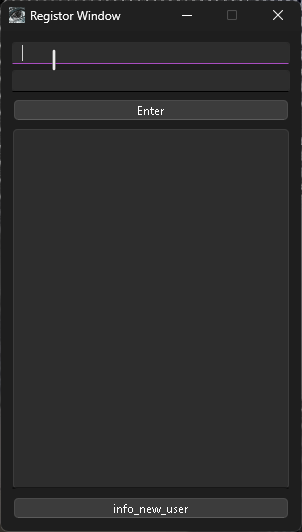
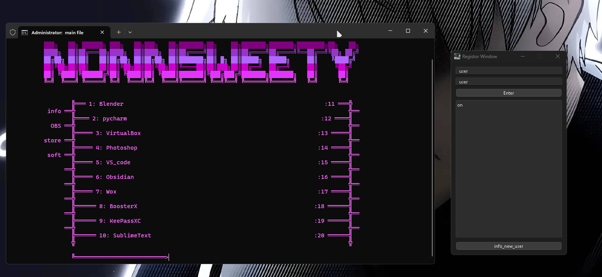
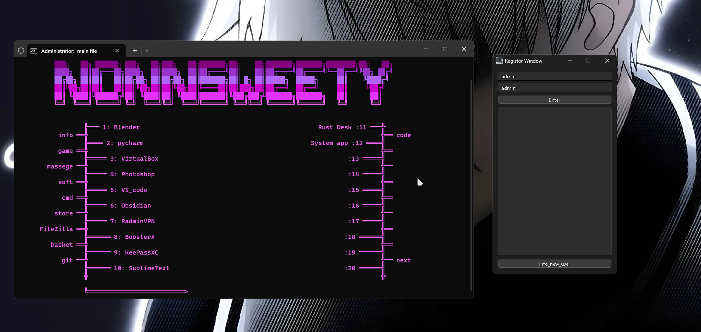
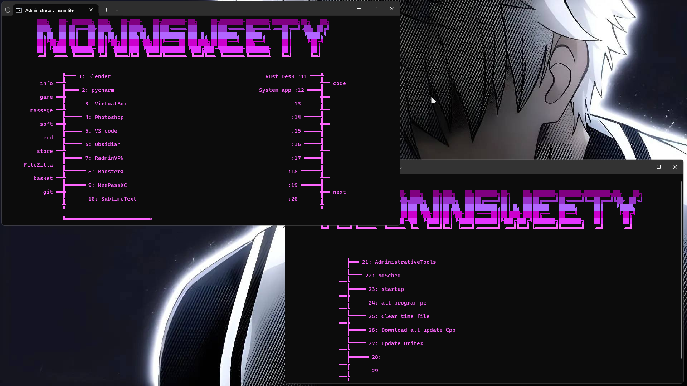

<h1 align="center">Choose Program</h1>

<h4 align="center">
  <a href="https://discord.com/invite/SFcSqZatPa" target="_blank">Discord</a>
  ·
  <a href="https://t.me/Trash_sweetyyy" target="_blank">Telegram</a>
  ·
  <a href="https://www.youtube.com/channel/UCeXL-Anplc8_IthxRIIHm7w" target="_blank">YouTube</a>
</h4>

 Здраствуйте, это прога больше всего под windows. Это програма запускает другие програмы <b>by nonnsweety</b>

## :star2: Download

[`install`](https://drive.google.com/drive/folders/1Wkaw0HefbGTPyhvJziirbmlt6gDHE_W2?usp=sharing)

[`install_2`](https://drive.google.com/drive/folders/18zr1H0zQUvtbjyXzwzvIVnOihCyLWzCd?usp=sharing)

## :star2: Preview

## :star2: What it is?

- Програма умет запускать любую програму на вашем комрьютере
- Может вам скачать C++ пакеты для того что бы менше проблем было
- Ещё может скачать DiretX
- Есть проги для того что бы оптимизировать ПК

## :star2: Other

- Програму сейчас запускается без никаких пробелем до этого надо было скачать пакеты для дого что она просто запустилась
- Если будут какие то проблемы то можете написать на Gmail: age2380@gmail.com

## :star2: on future

- В будущем програму можно будет запускать на linux
- Буду улучшать вид и удобство проги
