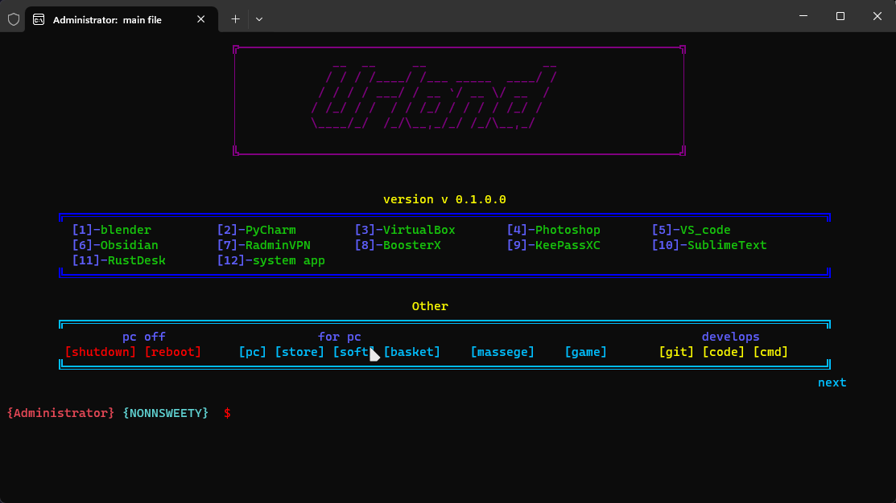
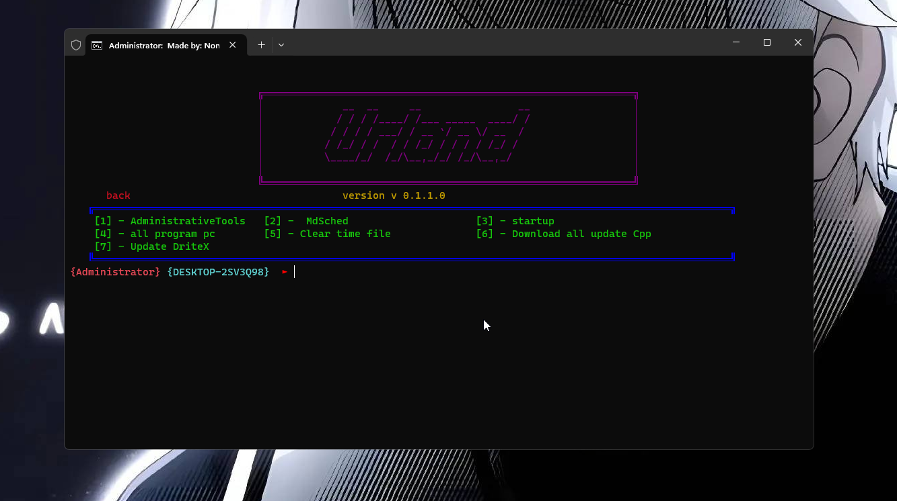
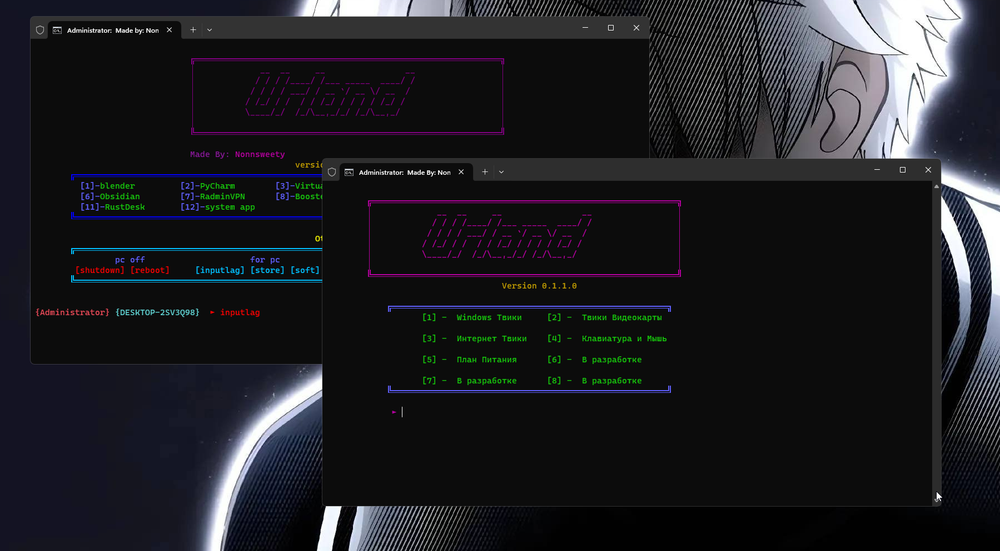

<h1 align="center">Urland</h1>

<h4 align="center">
  <a href="https://discord.com/invite/SFcSqZatPa" target="_blank">Discord</a>
  ·
  <a href="https://t.me/Trash_sweetyyy" target="_blank">Telegram</a>
  ·
  <a href="https://www.youtube.com/channel/UCeXL-Anplc8_IthxRIIHm7w" target="_blank">YouTube</a>
</h4>

 Програма создана для запуска программ и оптимизации системы <b>by nonnsweety</b>

## :star2: Download

[`install`](https://drive.google.com/drive/folders/1Wkaw0HefbGTPyhvJziirbmlt6gDHE_W2?usp=sharing)

[`install_2`](https://drive.google.com/drive/folders/18zr1H0zQUvtbjyXzwzvIVnOihCyLWzCd?usp=sharing)

## :star2: Preview

## :star2: What it is?

- Через Ярлыки других программа моя может запускать их
- Можно обновит DiretX и так же C++ всех годов
- Прогрмма так же может вам помочь отчистить мусор с компьютера
- Есть проложение boosterX для оптимизации системы
- Был добавлин inputlag свойство для оптимизации системы 
- Inputlag свойство это от Igromanoff
- Есть Install каторый скачивает нужные приложение 7zip, chrome, revo_uninstaller, steam

## :star2: Other

- Когда вы перейдете в next то вам надо будет сперва написать cls
- что бы у вас был задни вон не черный а фото то вам надо будет скачать terminal от microsoft в настройках можно будет поставит любое фото
- Если вы не знаете как узнать GUID видеокарты > Диспетчер устройств > Найдите видеокарту правой кнопкой свойство > Детали нажмите по стрелке и найдите > класс GUID правой кнопкой по цифрам и копируем
- Если будут какие то проблемы то можете написать на Gmail: age2380@gmail.com

## :star2: on future

- В будущем программу можно будет запускать на linux
- Буду улучшать вид и удобство проги :star2:("Done")
- Возможно сделаю что бы можно было устанавливать приложение сразу через мою программу :start2:("Done")

